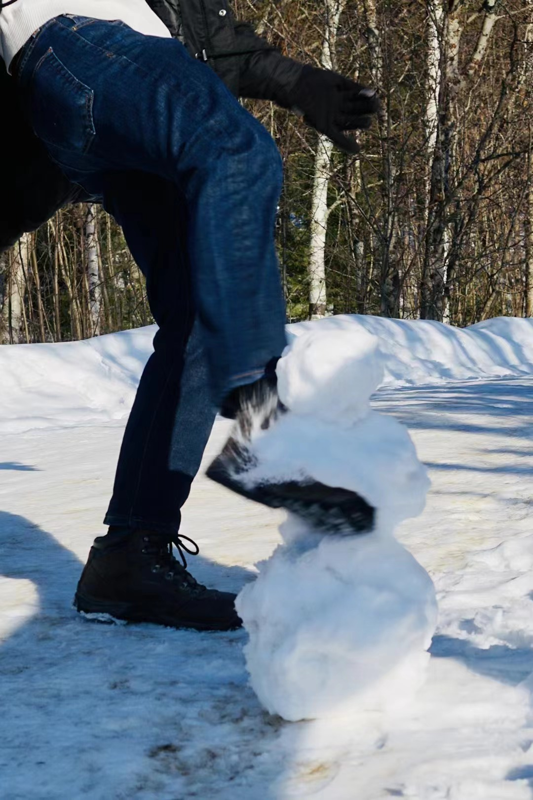
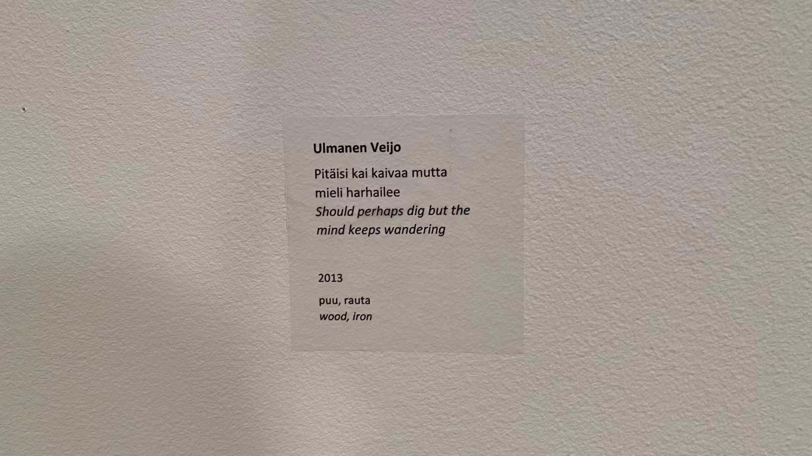

# Päiväkirja Rovaniemella 🙄
## Suomeksi

Rovaniemen Ruokasenkadulla ei ole ollenkaan ruokaa (vaan hautauspalvelua, tietenkin), ja kaaduin kadulla jäässä 5 kertaa päivässä.

> Hautauspalvelut Ruokasenkadulla.

<!--truncate-->
Mutta mielestäni mukaan, Rovaniemi oli muutakin kuin tylsyyttä. Ainakin ei kukaan enää vastannut englanniksi kun aloitin vuoropuheluja suomeksi. Sen takia olen oppinut yhtä paljon suomea kuin olen kaatunut lumessa. Mutta, kaikki puhuikin suomea kaverini kanssa, ja he eivät pystynyt ymmärtämään mitään kuitenkin.

Joulupukkia tai revontulia ei ollenkaan näy. Vain käyn taidemuseossa katsomassa, koska yksi kadulla olevien matkustajista suositteli. Mutta mieleni harhaili kuin kuvassa (tulossa löytyy).

Sitten menimme mäkeen, jolla oli paljon lunta. Allen teki lumiukon, ja sitten vahvasti potkii sen päähän. En tiedä mitä saan ajatella tästä.

> Allen potkaisi lumiukon.

En tiedä miksi maksoin melkein puoli budjetistani käydä tässä. Se sai minut kysymään itseltä elämästäni. Nyt odotan lennon takaisin Helsinkiin, ja ajattelen, että eilen Rovaniemellä vain oli totaalista outoa unta. No, ehkä on myös elämystä. En ole varma.

## In English
**Diary in Rovaniemi. 🙄**

There is no food at all on Ruokasenkatu (‘Foody street’ if I literally interpret it) in Rovaniemi (but only a funeral service, of course), and I fell on icy streets 5 times a day.

But I think Rovaniemi wasn’t quite just boring. At least nobody answered in English anymore when I started dialogues in Finnish. As a result, I have learned as much Finnish as I have fallen in the snow. But everyone spoke Finnish with my friends too, and they couldn't understand anything anyway.
There was no Santa Claus or northern lights at all. I only went to check out the art museum because one of the random passengers on the street recommended it. But my mind wandered as in the picture.

> Mieleni harhaili taidemuseossa.

Then we went to a hill with a lot of snow on it. Allen made a snowman, and then brutally kicked it in the head. I don't know what to make of this.

> Allen kicking the snowman.

I don't know why I spent almost half my budget to visit this place. It made me question myself about my life. Now waiting for my flight back to Helsinki, I'm thinking that yesterday in Rovaniemi was just an absolutely weird dream. Well, maybe there is an experience too. I'm not sure.
